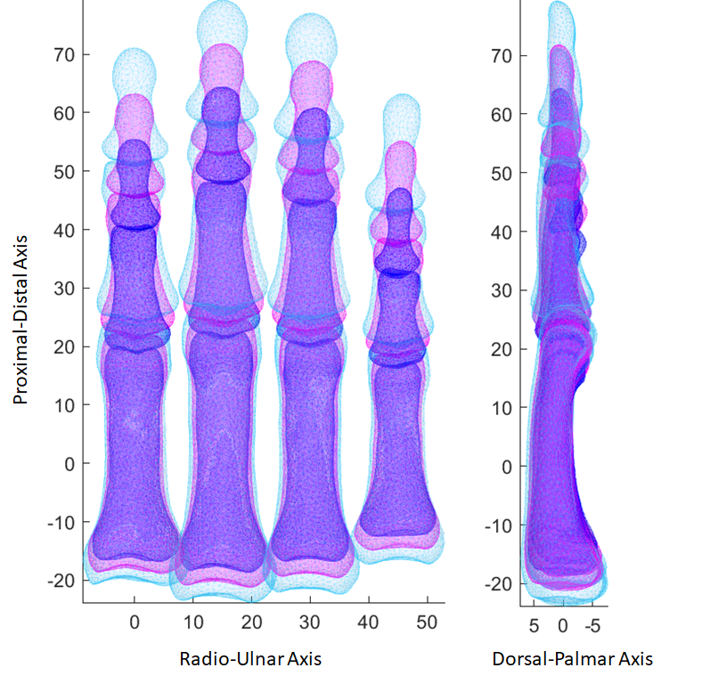

# Open Hands: an Open Source Statistical Finger Model
T.A. Munyebvu1, C.D. Metcalf2,3, M. Browne1, M.O.W. Heller1, A.S. Dickinson1

1 Faculty of Engineering & Physical Sciences, University of Southampton, Southampton, UK  
2 Faculty of Medicine, University of Southampton, Southampton, UK  
3 Faculty of Environmental & Life Sciences, University of Southampton, Southampton, UK  

## Background: 
Hand osteoarthritis (OA) affects joint movement and function, greatly impacting quality of life. Finger joint morphology is governed by the articulating bones and supporting ligaments, which differ between individuals and may be changed in disease. Population-based analysis of bone morphology using statistical shape modelling (SSM) can inform the design and testing of treatment devices and consumer products, as well as fundamental biomechanics studies. For example, statistical analysis of the thumb [1] has demonstrated morphological variation in the carpometacarpal joint. However, few researchers have access to the anatomic data required for such analysis, and there is cost, and risk associated with CT or MRI scanning volunteers. Therefore, this paper presents multi-body statistical shape models of the four fingers of the hand, providing models that can be published for open use whilst preserving the security of the underlying imaging data, for the purpose of supporting wider community efforts in hand biomechanical analysis. 

## Methods: 
A multi-body SSM pipeline was implemented in MATLAB (MathWorks, USA) on an exemplar training population of 10 right hands, imaged by CT at 0.3mm resolution, segmented, meshed and aligned [2]. Consenting participants (5F:5M, 27-37yrs) were free from disease or injury (ethics refs: IRAS 14/LO/1059 & ERGO 61718). Model generation included (1) non-rigid registration [3] for point correspondence between datasets, (2) estimation of interphalangeal joint axes and placing them into neutral flexion, to remove alignment variation during imaging, and (3) principal component analysis (PCA) for dimensionality reduction of size and shape variation. Nine principal components (PCs) of morphological variation were found for the distal, medial and proximal phalanx of the index, middle, ring and little finger. A Leave-One-Out cross-validation test was performed, calculating the mean vertex error in reconstructing the mean shape.

## Results: 

  

The first PC represented phalanx size in all fingers and accounted for over 45% of the variation (Fig.1). Gross measures were extracted to illustrate this variation in scale (Table 1). Subsequent PCs showed variation in position along the palmar-dorsal axis and bone breadth. Repositioning successfully removed joint flexion variation from the PC results. The model has been shared as an open-source repository (https://github.com/abel-research/OpenHands).  

## Discussion: 
This study presents a pipeline for generating an anonymised finger SSM from healthy, living participants. The model describes a small, homogeneous population, and assumptions cannot be made about how it represents individuals outside the training dataset. However, it supplements gross anthropometric datasets with additional shape information, and if trained with additional CT images the model may be of use for investigating factors such as joint morphology, and for design of hand-interfacing devices and products. We encourage the community to use it, and to contribute. 

## References: 
[1] Rusli & Kedgley (2020), Biomech Model Mechanobiol, https://doi.org/10.1007/s10237-019-01257-8;  
[2] Metcalf et al. (2020), Annals of Biomedical Engineering https://doi.org/10.1007/s10439-020-02476-2;  
[3] Manu (2021). nonrigidICP Version 1.16.0.2 (https://www.mathworks.com/matlabcentral/fileexchange/41396-nonrigidicp), MATLAB Central File Exchange.

## Acknowledgments and Funding: 
We thank Prof D Warwick, Dr L King, Dr A Darekar, and C Everitt for development of the imaging protocol and original data collection. This research was supported by funding from the European Union's Horizon 2020 program (ref. 863183).
